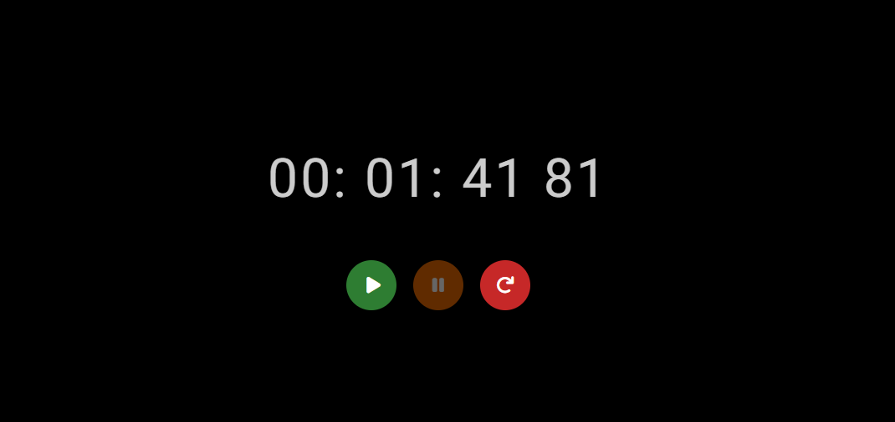

# 🕒 Cronômetro Elegante

Este projeto é um **cronômetro responsivo** desenvolvido em **HTML, CSS e JavaScript**, com um design minimalista e elegante.  
Ele permite **iniciar, pausar e resetar** o tempo, exibindo horas, minutos, segundos e milissegundos.

---

## ✨ Funcionalidades

- ✅ Iniciar a contagem do tempo
- ✅ Pausar a contagem a qualquer momento
- ✅ Resetar o cronômetro para zero
- ✅ Interface simples, limpa e elegante
- ✅ Totalmente responsivo (funciona em celular, tablet e desktop)

---

## 🚀 Tecnologias Utilizadas

- **HTML5** – Estrutura da página  
- **CSS3** – Estilização e responsividade  
- **JavaScript** – Lógica do cronômetro (contagem, controle e atualização do display)

---

## 📸 Demonstração

